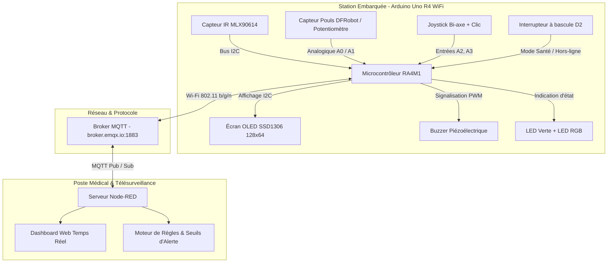

# 1. Aperçu Général du Projet (Project Overview)

## 🎯 Objectifs et Contexte Biomédical

Lors d'un entraînement sur home-trainer ou d'une séance de réadaptation cardiorespiratoire (post-infarctus, insuffisance cardiaque ou réhabilitation respiratoire), la surveillance en continu des constantes physiologiques est indispensable pour prévenir tout surmenage ou accident ischémique.

Ce projet propose une solution **IoT intégrée de bout en bout** associant :
1. Une station embarquée basée sur un microcontrôleur **Arduino Uno R4 WiFi** dotée de capteurs biomédicaux et d'organes IHM (Interface Homme-Machine).
2. Une passerelle de télémétrie s'appuyant sur le protocole de messagerie léger **MQTT**.
3. Une plateforme de centralisation et de supervision **Node-RED Dashboard 2.0** permettant au praticien de suivre l'effort, d'ajuster les seuils de tolérance et de déclencher des alertes ciblées.

---

## 🏗️ Architecture Globale du Système

Le système s'articule autour de trois couches interconnectées :



<!-- ESPACE SCHÉMA : SYNOPTIQUE GÉNÉRAL DU SYSTÈME -->
> ### 📊 [ESPACE SCHÉMA - Diagramme Synoptique du Système]
> *Insérez ici le diagramme bloc ou schéma fonctionnel de votre projet.*
> 
> ```markdown
> 
> ```

---

## 🔄 Modes de Fonctionnement

### 1. Mode Télésurveillance Médicale (Interrupteur sur ON)
* **Mesures Physiologiques** : 
  * Fréquence cardiaque calculée en temps réel (battements par minute).
  * Température corporelle sans contact (thermométrie infrarouge).
* **Double Affichage OLED** :
  * **Page 1 (Principal)** : Température corporelle grand format (°C), Fréquence Cardiaque (BPM), Source de mesure active (`capt` pour capteur réel, `pot` pour simulateur d'effort), Statut d'alerte (`OK` / `ALERTE`), Guide utilisateur (*"Posez le doigt"*).
  * **Page 2 (Diagnostics)** : État de la connexion Wi-Fi et du lien MQTT, Qualité du signal cardiaque, Mode de calcul des seuils (*Dashboard distant* vs *Repli de secours local*).
* **Bascule Rapide de Source BPM** :
  * Par pression sur le clic du joystick ou via commande distante Node-RED (`gaelle-capteurs/source_cmd`).
* **Gestion des Alarmes Intelligentes** :
  * Alerte Cardiaque : LED RGB clignotante rouge + Mélodie de Mozart (*Une petite musique de nuit* KV 525).
  * Alerte Thermique : LED RGB clignotante bleue + Séquence de bips d'urgence à 600 Hz.
  * Alerte Mixte (Double Dépassement) : Clignotement alterné Rouge/Bleu + Alternance continue Mélodie / Bips.

### 2. Mode Hors-ligne / Divertissement (Interrupteur sur OFF)
* L'acquisition des signaux vitaux est mise en veille sécurisée (publication de valeurs nulles et notification d'arrêt).
* La station bascule en mode détente en exécutant sur l'écran OLED le jeu **Chrome Dino** avec simulation physique fidèle (accélération, gravité, calcul des collisions par boîtes englobantes, génération pseudo-aléatoire d'obstacles : petits cactus, grands cactus et ptérodactyles volants).
* Les scores de jeu et records historiques sont conservés et publiés via MQTT sur le topic dédié `gaelle-capteurs/dino_score`.

---

## 📚 Liens et Prérequis Utiles

Pour reproduire ou étendre ce projet, consultez les ressources documentaires suivantes :
* [Tutoriel Random Nerd Tutorials - ESP32 / Arduino MQTT](https://randomnerdtutorials.com/esp32-mqtt-publish-subscribe-arduino-ide/)
* [Documentation Officielle Arduino Uno R4 WiFi](https://docs.arduino.cc/hardware/uno-r4-wifi/)
* [Guide Node-RED Dashboard 2.0 (@flowfuse/node-red-dashboard)](https://dashboard.flowfuse.com/)
* [Documentation Bibliothèque Graphique U8g2](https://github.com/olikraus/u8g2/wiki)
* [Spécifications Capteur Infrarouge Melexis MLX90614](https://www.melexis.com/en/product/MLX90614/)

> [!NOTE]
> **Librairies à déclarer dans PlatformIO (`platformio.ini`) / Arduino IDE** :
> * `WiFiS3`
> * `PubSubClient` (Nick O'Leary)
> * `Wire`
> * `U8g2` (Oliver Kraus)
> * `Adafruit MLX90614 Library`
> * `DFRobot_Heartrate`
