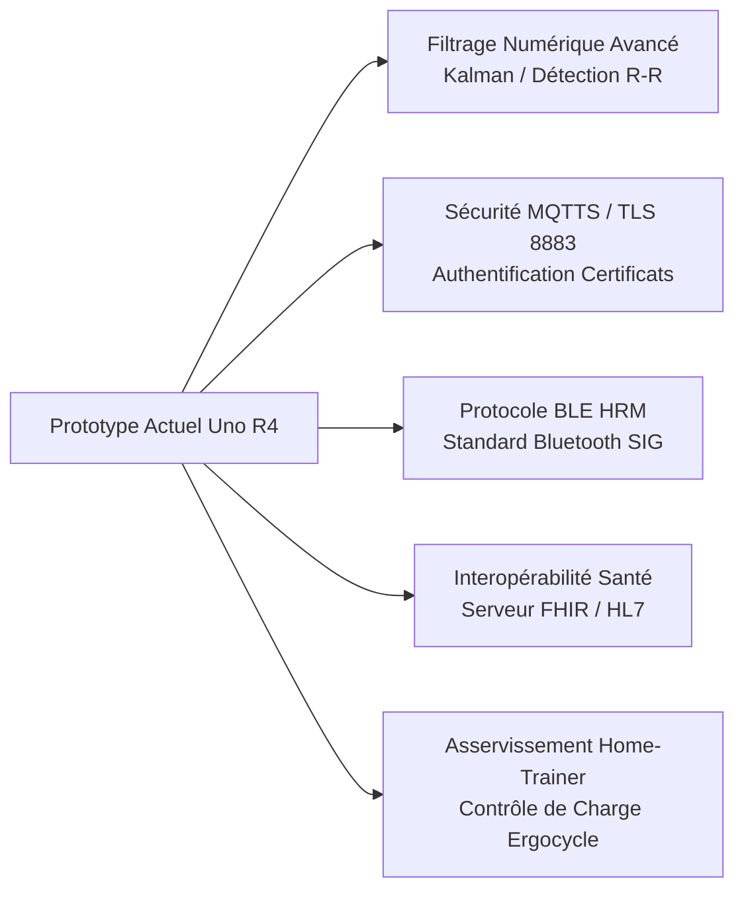

# 6. Analyse Critique et Perspectives d'Amélioration (Critique & Improvements)

Toute démarche d'ingénierie biomédicale rigoureuse requiert une analyse critique des performances du prototype, de ses limites opérationnelles et des axes de valorisation future.

---

## 🔍 Analyse Critique du Système Actuel

### 1. Limites Physiologiques et Capteurs
* **Artefacts de Mouvement sur le Capteur PPG** : Lors d'un pédalage intense sur home-trainer, les secousses mécaniques et la sudation au bout du doigt perturbent le couplage optique de la photopléthysmographie, provoquant des faux pics ou des pertes transitoires de signal.
* **Mesure Thermique Infrarouge Cutanée** : Le capteur MLX90614 mesure la température de surface de la peau (front ou poignet). Or, lors d'un effort physique, la vasodilatation cutanée et l'évaporation de la sueur induisent un écart thermique significatif par rapport à la température centrale (core temperature). Un recalibrage ou algorithme de compensation dynamique est nécessaire.

### 2. Choix d'Architecture Matérielle
* **Bus I2C Unique Partagé** : La cohabitation du MLX90614 (SMBus standard) et de l'écran SSD1306 a nécessité une astuce logicielle de commutation de fréquence (100 kHz / 400 kHz). L'utilisation d'un second bus I2C matériel (disponible sur certains microcontrôleurs) aurait isolé les flux et évité tout compromis.
* **Ordonnancement Coopératif vs RTOS** : Bien que l'architecture à base de `millis()` soit légère et efficace, l'utilisation d'un système d'exploitation temps réel tel que **FreeRTOS** aurait permis de découpler formellement les priorités (tâche d'acquisition critique prioritaire sur le rendu graphique).

### 3. Sécurité et Réseau
* **Broker MQTT Public Non Chiffré** : L'utilisation de `broker.emqx.io:1883` en clair sans authentification forte ni chiffrement TLS expose les données physiologiques du patient à des risques d'interception ou d'injection.

---

## 🚀 Perspectives d'Amélioration et Défis Futurs

### 1. Traitement Numérique du Signal Avancé (DSP)
* Implémentation d'un **filtre de Kalman** ou d'un algorithme de détection de pics adaptatif (Pan-Tompkins simplifié) pour extraire la variabilité de la fréquence cardiaque (VRC / HRV), marqueur clinique de la fatigue et du stress autonome.

### 2. Sécurisation des Flux Médicaux (Cyber-santé)
* Migration vers le protocole **MQTTS sécurisé** (port 8883) avec certificats X.509 et chiffrement TLS v1.3 pour garantir la confidentialité et l'intégrité des données de santé conformément au RGPD et à la certification HDS (Hébergeur de Données de Santé).

### 3. Connectivité Hybride Bluetooth Low Energy (BLE)
* Exploitation du module ESP32-S3 de l'Arduino Uno R4 pour exposer le profil standardisé **BLE Heart Rate Service (GATT UUID 0x180D)**, rendant le prototype directement compatible avec les montres connectées, compteurs vélo (Garmin, Wahoo) et applications de fitness (Zwift, Strava).

### 4. Asservissement en Boucle Fermée de la Résistance du Home-Trainer
* Intégration d'un servomoteur ou d'un frein électromagnétique pour moduler automatiquement la résistance de pédalage : si le rythme cardiaque du patient approche du seuil critique, le système allège automatiquement la charge d'effort pour préserver sa sécurité cardiovasculaire.

### 5. Intégration dans le Dossier Patient Informatisé (DPI)
* Passerelle directe entre Node-RED et des architectures d'interopérabilité hospitalière via des ressources **HL7 FHIR** (`Observation: Heart rate`, `Observation: Body temperature`).
