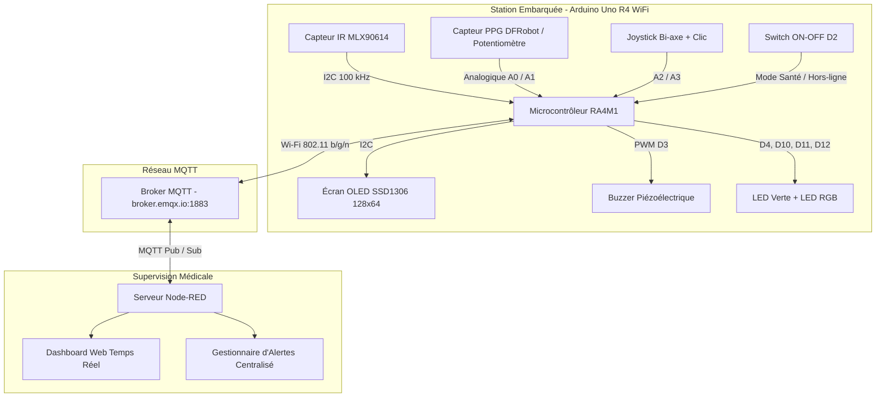

# 🚴 Prototype Biomédical Connecté pour Home-Trainer (Arduino Uno R4 WiFi + MQTT + Node-RED)

Dans ce projet complet, nous concevons et développons une station biomédicale connectée d'assistance et de télésurveillance pour home-trainer. Le système acquiert en continu le rythme cardiaque et la température corporelle sans contact, transmet les données en temps réel via MQTT vers un tableau de bord de télémédecine Node-RED, gère des alarmes sonores et visuelles intelligentes (avec algorithme de repli local), et intègre un mode hors-ligne ludique (jeu Chrome Dino sur écran OLED 128x64).

---

## 📸 1. Présentation Visuelle du Prototype

<!-- ESPACE PHOTO : PHOTO DU PROTOTYPE EN FONCTIONNEMENT -->
> ### 🖼️ [ESPACE PHOTO - Prototype en fonctionnement]
> *Insérez ici une photo globale de votre banc de test opérationnel (Arduino, capteurs, écran OLED et dashboard Node-RED).*
> 
> ```markdown
> 
> ```

---

## 🌐 2. Aperçu du Projet (Project Overview)

Le dispositif assiste un patient ou un sportif lors d'un effort sur vélo d'appartement :



<!-- ESPACE SCHÉMA : SYNOPTIQUE DU PROJET -->
> ### 📊 [ESPACE SCHÉMA - Diagramme Fonctionnel Général]
> *Insérez ici le diagramme bloc de votre architecture globale.*
> 
> ```markdown
> 
> ```

### Fonctionnalités Clés :
* **Double Mode d'Exploitation** : Mode Télésurveillance Médicale continue vs Mode Hors-ligne / Détente (Jeu Dino avec accélération et physique).
* **Double Source de Fréquence Cardiaque** : Capteur optique PPG DFRobot réel ou Potentiomètre simulateur (0 - 210 BPM), commutable instantanément au joystick ou à distance depuis Node-RED.
* **Double Page sur Écran OLED** : Page 1 (Données vitales et conseils) & Page 2 (Statut Wi-Fi, MQTT et diagnostic capteur).
* **Système d'Alerte Audiovisuel Intelligent** :
  * Alerte Cardiaque : LED Rouge clignotante + Mélodie de Mozart (*Une petite musique de nuit* KV 525).
  * Alerte Thermique : LED Bleue clignotante + Bips d'urgence à 600 Hz.
  * Double Alerte : Clignotement alterné Rouge/Bleu + Alternance continue Mélodie / Bips.
* **Sécurité & Failsafe (Repli Local)** : En cas de déconnexion réseau, bascule automatique sur un calcul de seuils locaux à hystérésis (`SEUIL_BPM_SECOURS = 120`, `SEUIL_TEMP_SECOURS = 37.5°C`).

---

## 📚 3. Prérequis et Liens Utiles

Pour la prise en main et la reproduction des différentes briques :
* [Tutoriel de Référence Random Nerd Tutorials (ESP32 MQTT Publish & Subscribe)](https://randomnerdtutorials.com/esp32-mqtt-publish-subscribe-arduino-ide/)
* [Documentation Technique Arduino Uno R4 WiFi](https://docs.arduino.cc/hardware/uno-r4-wifi/)
* [Documentation Node-RED Dashboard 2.0](https://dashboard.flowfuse.com/)
* [Guide de la Bibliothèque Graphique U8g2](https://github.com/olikraus/u8g2/wiki)

> [!NOTE]
> **Librairies utilisées dans PlatformIO (`platformio.ini`) / Arduino IDE** :
> `WiFiS3`, `PubSubClient`, `Wire`, `U8g2`, `Adafruit MLX90614 Library`, `DFRobot_Heartrate`.

---

## 🧰 4. Composants Nécessaires (Parts Required)

| Composant / Module | Référence & Spécifications | Quantité | Rôle dans le Système |
| :--- | :--- | :---: | :--- |
| **Carte Microcontrôleur** | **Arduino Uno R4 WiFi** (Renesas RA4M1 32-bit + ESP32-S3) | 1 | Contrôleur central, acquisition et connectivité MQTT |
| **Capteur de Température Infrarouge** | **GY-906 / MLX90614** (I2C, 3.3V-5V, précision ±0.5°C) | 1 | Mesure sans contact de la température corporelle cutanée |
| **Capteur de Fréquence Cardiaque** | **DFRobot Heart Rate Sensor** (SEN0203 / SEN0213 ou PPG) | 1 | Mesure du pouls par photopléthysmographie au doigt |
| **Écran Graphique OLED** | **SSD1306 0.96" I2C 128x64** (Monochrome) | 1 | Affichage multi-pages des constantes, diagnostics et jeu Dino |
| **Module Joystick Analogique** | **Joystick 2 axes + Clic poussoir** (KY-023) | 1 | Navigation entre les pages OLED, bascule de source et contrôle du jeu |
| **Potentiomètre Rotatif** | **Potentiomètre linéaire 10 kΩ (B10K)** | 1 | Simulateur d'effort cardiaque (0 à 210 BPM) |
| **Buzzer Piézoélectrique** | **Buzzer 5V** (compatible `tone()`) | 1 | Signalisation acoustique d'alarme et effets sonores |
| **LED Témoin d'État** | **LED Verte standard 5 mm** | 1 | Témoin visuel de mise sous tension du mode santé |
| **LED d'Alarme Multi-couleurs** | **Module LED RGB 5 mm (Cathode Commune)** | 1 | Témoin lumineux multi-alertes (Rouge: BPM, Bleu: Temp, Vert: OK) |
| **Interrupteur Principal** | **Switch à bascule 2 positions ON-OFF** | 1 | Sélection Mode Santé / Mode Hors-ligne |
| **Résistances de Protection** | **Résistances 220 Ω (1/4 W)** | 4 | Protection des branches LED |
| **Câblage & Breadboard** | **Breadboard standard 830 points + Fils Jumpers** | 1 lot | Raccordement du banc de prototypage |

---

## 🔌 5. Schéma Électrique & Câblage (Circuit & Wiring)

### Tableau de Correspondance des Broches

| Broche Arduino | Module Associé | Broche Module | Signal | Rôle |
| :--- | :--- | :--- | :--- | :--- |
| **5V / GND** | Tous les modules | VCC / GND | Alimentation | Rails de puissance 5V DC et masse commune |
| **SDA (A4) / SCL (A5)** | MLX90614 & OLED | SDA / SCL | Numérique I2C | Bus I2C partagé (MLX: `0x5A`, OLED: `0x3C`) |
| **A0** | Potentiomètre B10K | Curseur | Entrée Analogique | Simulation BPM (0 - 1023 -> 0 - 210 BPM) |
| **A1** | Capteur Pouls DFRobot | Signal (S) | Entrée Analogique | Signal brut du capteur cardiaque optique |
| **A2** | Joystick | Axe Y / Clic | Entrée Analogique | Saut/Baisser Dino et Clic multifonction |
| **A3** | Joystick | Axe X | Entrée Analogique | Défilement horizontal des pages OLED |
| **D2** | Interrupteur | Borne active | Numérique (PULLUP) | `LOW` = Mode Santé, `HIGH` = Mode Dino |
| **D3** | Buzzer | Pôle (+) | Sortie PWM | Sortie audio des alertes et mélodies |
| **D4** | LED Verte | Anode (+ 220Ω) | Sortie Numérique | Indication de fonctionnement actif |
| **D10** | LED RGB | Vert (+ 220Ω) | Sortie Numérique | Indication état nominal / dashboard |
| **D11** | LED RGB | Rouge (+ 220Ω) | Sortie Numérique | Alarme cardiaque (tachycardie) |
| **D12** | LED RGB | Bleu (+ 220Ω) | Sortie Numérique | Alarme thermique (hyperthermie) |

<!-- ESPACE SCHÉMA : SCHÉMA ÉLECTRIQUE WOKWI / CIRKIT DESIGNER -->
> ### ⚡ [ESPACE SCHÉMA - Schéma Électrique Simplifié]
> *Insérez ici votre schéma de circuit réalisé avec [Wokwi.com](https://wokwi.com/) ou [Cirkit Designer](https://app.cirkitdesigner.com/project).*
> 
> ```markdown
> 
> ```

<!-- ESPACE PHOTO : PHOTO DU MONTAGE RÉEL -->
> ### 🖼️ [ESPACE PHOTO - Montage Électronique Réel sur Platine]
> *Insérez une photo en gros plan de la breadboard câblée.*
> 
> ```markdown
> 
> ```

---

## 📡 6. Architecture MQTT et Tableau de Bord Node-RED

### Matrice des Topics MQTT

| Topic MQTT | Direction | Payload | Fréquence / Rôle |
| :--- | :---: | :--- | :--- |
| `gaelle-capteurs/bpm` | Uno R4 -> Node-RED | Entier (ex: `82`) | Périodique (1s) - Fréquence cardiaque |
| `gaelle-capteurs/temperature` | Uno R4 -> Node-RED | Flottant (ex: `37.1`) | Périodique (1s) - Température corporelle |
| `gaelle-capteurs/bouton` | Uno R4 -> Node-RED | `"on"` / `"off"` | Sur changement de position du switch |
| `gaelle-capteurs/source` | Uno R4 -> Node-RED | `"capteur"` / `"pot"` | Notification de la source active |
| `gaelle-capteurs/signal_bpm` | Uno R4 -> Node-RED | `"ok"` / `"aucun"` | Détection de contact du doigt |
| `gaelle-capteurs/dino_score` | Uno R4 -> Node-RED | `{"score":X,"record":Y}` | Score de fin de partie Dino |
| `gaelle-capteurs/alarme_bpm` | Node-RED -> Uno R4 | `"on"` / `"off"` | Déclenchement alarme cardiaque |
| `gaelle-capteurs/alarme_temp` | Node-RED -> Uno R4 | `"on"` / `"off"` | Déclenchement alarme thermique |
| `gaelle-capteurs/source_cmd` | Node-RED -> Uno R4 | `"capteur"` / `"pot"` | Forçage de source à distance |
| `gaelle-capteurs/led1` | Node-RED -> Uno R4 | `"on"` / `"off"` | Contrôle manuel de la LED verte |

<!-- ESPACE PHOTO : CAPTURE DU FLOW NODE-RED -->
> ### 📊 [ESPACE CAPTURE - Flow Node-RED]
> *Insérez une capture d'écran de l'ensemble des nœuds du flow Node-RED.*
> 
> ```markdown
> 
> ```

<!-- ESPACE PHOTO : CAPTURE DU DASHBOARD NODE-RED -->
> ### 💻 [ESPACE CAPTURE - Dashboard Web de Supervision]
> *Insérez une capture d'écran du tableau de bord utilisateur (jauges, graphiques temporels et bannières).*
> 
> ```markdown
> 
> ```

---

## 💻 7. Explications Clés du Code Source

> Le code Arduino complet et prêt à l'emploi est disponible dans le fichier [`hometrainer_dino_final.ino`](../hometrainer_dino_final.ino).

### 1. Cadencement Asynchrone Non-Bloquant (`millis()`)
Aucune fonction `delay()` n'est utilisée dans le programme. Les tâches d'échantillonnage (20 ms), d'acquisition thermique (500 ms), de rafraîchissement d'affichage (33 ms / 500 ms) et de publication MQTT (1000 ms) sont gérées par des temporisateurs différentiels indépendants.

### 2. Commutation d'Horloge I2C (100 kHz <-> 400 kHz)
Le firmware bascule dynamiquement l'horloge I2C à **400 kHz** en mode Dino pour une animation à 30 FPS, et la rétablit à **100 kHz** en mode Santé pour respecter les spécifications SMBus du capteur MLX90614.

### 3. Redondance des Alertes & Repli Local Autonome (Failsafe)
En cas de déconnexion du courtier MQTT, l'Arduino applique automatiquement son propre moteur de décision à hystérésis (`seuilHyst`), évitant les déclenchements parasites lors des oscillations de signal.

### 4. Moteur Musical & Entrelacement d'Alarmes
Le module sonore gère un automate non-bloquant capable de jouer la mélodie de Mozart (*Une petite musique de nuit* KV 525) pour l'alerte cardiaque, une série de bips d'urgence pour l'hyperthermie, ou une alternance des deux si les deux constantes sont dépassées.

---

## 🎯 8. Analyse Critique et Perspectives d'Avenir

### 🔍 Critique et Limites du Système Actuel :
1. **Sensibilité aux Artefacts de Mouvement** : Le capteur optique au doigt est sensible aux vibrations du pédalage.
2. **Température Cutanée vs Centrale** : La mesure infrarouge cutanée peut sous-estimer la température centrale en cas de sudation intense.
3. **Sécurité Réseau** : L'utilisation d'un broker public en clair sans chiffrement TLS doit être bannie en production médicale réelle.

### 🚀 Perspectives d'Évolution :
1. **Chiffrement MQTTS (TLS 1.3 - Port 8883)** pour garantir la sécurité et la confidentialité des données de santé (HDS / RGPD).
2. **Filtrage de Kalman / Algorithme R-R** pour extraire la variabilité de la fréquence cardiaque (HRV).
3. **Profil Standardisé Bluetooth Low Energy (BLE Heart Rate Service 0x180D)** via l'ESP32-S3 embarqué pour connexion directe aux compteurs vélo et montres de sport.
4. **Asservissement du Home-Trainer** : Régulation automatique de la résistance de freinage du vélo selon la zone de fréquence cardiaque cible du patient.
5. **Interopérabilité Hospitalière HL7 / FHIR** pour intégration directe dans le Dossier Patient Informatisé.
